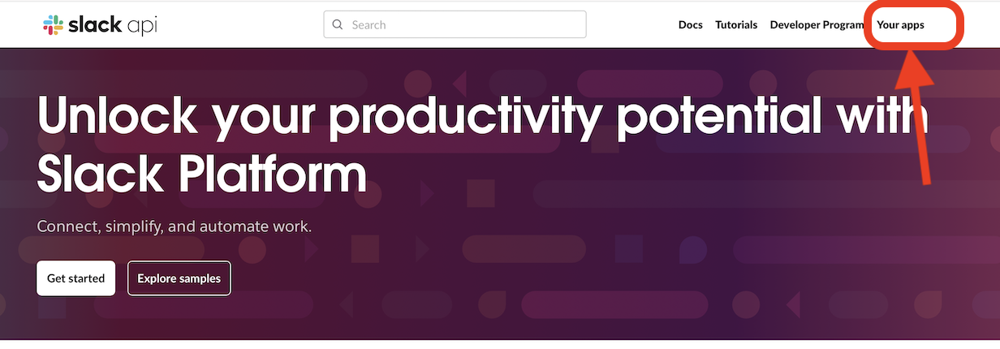
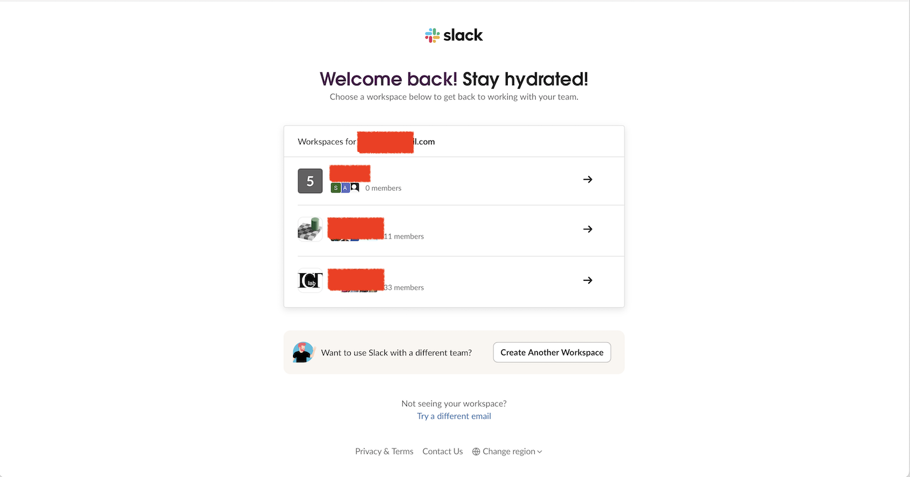
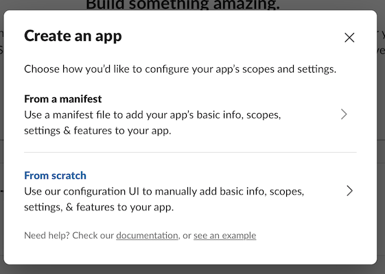
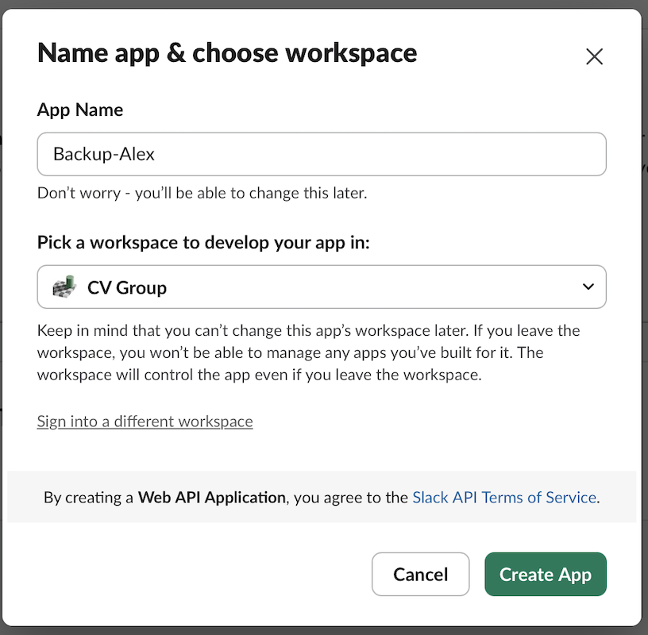
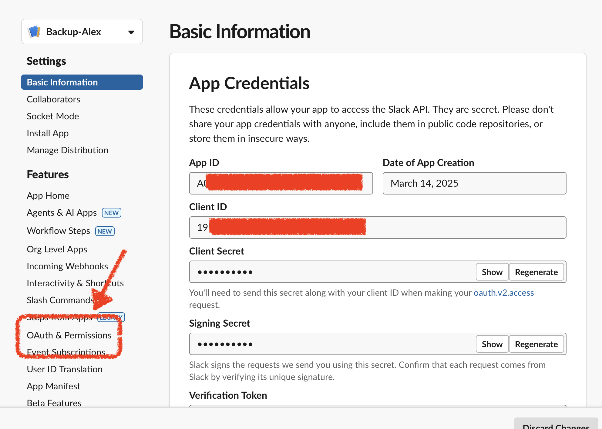
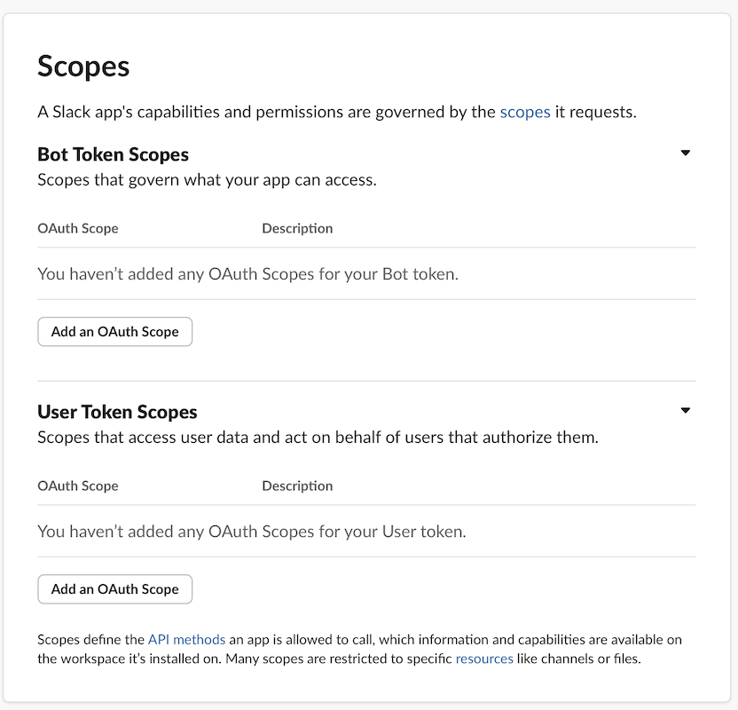
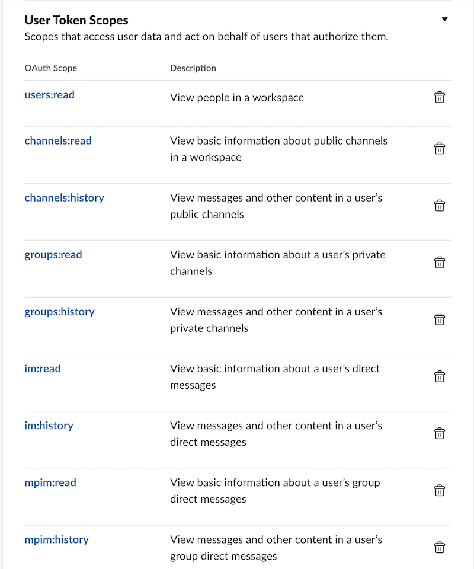
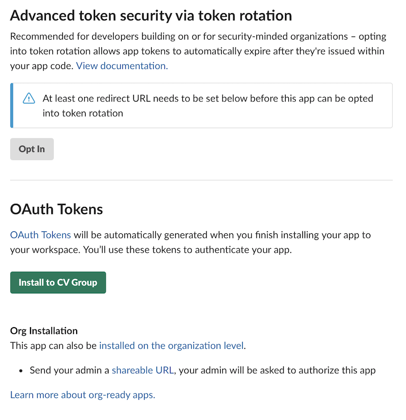
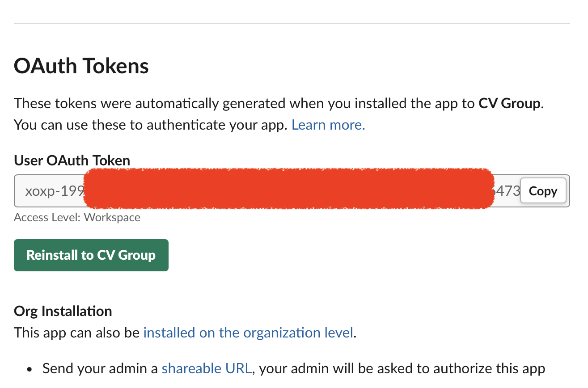

Step by step instruction on how to obtain the **User OAuth Token**.

**Create a Slack App**:
1. Go to the [Slack API](https://api.slack.com/) website and click "**Your apps**" in the top right corner. If you are not signed in, it will ask you to _sign in into your Slack account_.
	   
	   
   
2. After signing in, select the workspace you want to login.
	   

3. The website probably will not redirect you the the API page, but brings you to the Slack chat page. So you need to type the URL in the address bar again: [https://api.slack.com/apps](https://api.slack.com/apps). **Do not type the address until you see this page**:
	   

4. Then click the **Create an App** button to create a new app. 
	   
	   
   
5. In the prompt dialog, select **From scratch**:

	 
   
6. Create an app name, and select your workspace. (It's recommended to use your name/alias as the prefix/suffix of the app name) You can always change it later, so no need to hesitate
	   

7. Clicking **Create App**, you will see the information page of your Slack app. Select **OAuth & Permissions** on the left side:
	

8. Scroll down to the **Scopes** section, in the **User Token Scopes** part, Add the following OAuth scopes to your app:
     - `channels:history`
     - `channels:read`
     - `groups:history`
     - `groups:read`
     - `im:history`
     - `im:read`
     - `mpim:history`
     - `mpim:read`
     - `users:read`
     - `files:read`
 
	
	**IMPORTANT**: Make sure you add the scopes in the `User Token Scopes`, `Bot Token Scopes` won't work!
	
9. Scroll up, find the **Install** button and install the app to your workspace
	
10. After installing the app to your workspace, you will see the **User OAuth Token**, copy it into the `config.txt` file in this project source code, and you are good to go!
	